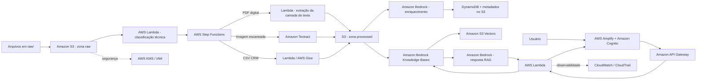

# 🧠 Wiki Corporativa Inteligente na AWS

Solução proposta para o desafio **A Wiki Perdida dos Arquivos Corporativos**, do Bootcamp Nublify/DIO. O objetivo é transformar documentos corporativos heterogêneos e desorganizados em uma base consultável em linguagem natural, com respostas fundamentadas e referência ao arquivo de origem.

> A proposta usa somente serviços AWS para armazenamento, OCR, orquestração, enriquecimento com IA, busca vetorial, autenticação, auditoria e monitoramento.

## 📚 Projetos neste repositório

Este repositório reúne duas entregas práticas de IA e AWS:

1. **Wiki Corporativa Inteligente na AWS** — arquitetura RAG para documentos heterogêneos, detalhada neste README e em [`resposta.md`](./resposta.md).
2. **[Análise Avançada de Imagens e Texto com IA na AWS](./analise-avancada-imagens-texto-aws/)** — pipeline serverless utilizando Amazon S3, Textract, Rekognition, Bedrock, Lambda e Step Functions para analisar imagens e documentos.

---

## 🎯 Problema

A empresa mantém registros comerciais misturados em uma única pasta `raw/`:

- `ata_reuniao_vendas_sa.pdf` — PDF digital de 5 páginas, com camada de texto;
- `ata_resultados_vendas_novos_dados.png` — página digitalizada, composta por imagem e com anotações manuscritas;
- `vendas_sa_dados_ficticios_laboratorio.csv` — exportação do CRM com 240 oportunidades e 19 colunas.

Esses três formatos não devem seguir o mesmo processamento. O PDF digital não precisa de OCR, a imagem precisa de OCR e o CSV deve preservar sua estrutura tabular antes de ser projetado para busca semântica.

## 🏗️ Arquitetura proposta



## 🔄 Como cada formato é tratado

### PDF digital

O arquivo já possui texto pesquisável. Uma função AWS Lambda identifica a camada textual e extrai o conteúdo **sem OCR**, evitando custo e possíveis erros de reconhecimento. O texto normalizado é gravado no S3 junto com metadados e referência à página de origem.

### Imagem digitalizada

A imagem é enviada ao **Amazon Textract**, que detecta texto digitado e manuscrito. O resultado inclui texto, localização e confiança. Trechos com confiança abaixo do limite definido podem ser marcados para revisão humana antes de serem considerados confiáveis pela Wiki.

### CSV do CRM

O CSV não é tratado como um texto longo. O schema é validado e catalogado, e cada oportunidade vira uma unidade lógica independente. Os 19 campos relevantes são preservados e também projetados para um registro textual pesquisável. Isso evita misturar dados de oportunidades diferentes durante o chunking.

## 🧩 Serviços AWS escolhidos

| Serviço | Papel |
|---|---|
| Amazon S3 | Armazenamento das zonas `raw`, `processed` e artefatos de metadados |
| AWS KMS | Criptografia com chaves gerenciadas |
| AWS IAM | Menor privilégio entre os componentes |
| AWS Lambda | Classificação, extração do PDF digital, normalização e APIs |
| AWS Step Functions | Orquestração, retries e tratamento de erros |
| Amazon Textract | OCR da imagem, inclusive texto manuscrito |
| AWS Glue Data Catalog | Catálogo do schema do CSV e descoberta dos dados estruturados |
| Amazon Bedrock | Enriquecimento, resumos e geração das respostas |
| Amazon Bedrock Knowledge Bases | Pipeline RAG gerenciado e recuperação com fontes |
| Amazon S3 Vectors | Armazenamento vetorial para embeddings |
| Amazon DynamoDB | Estado de processamento e metadados ricos por documento |
| Amazon Cognito | Autenticação e grupos de acesso |
| Amazon API Gateway | Entrada segura da API da Wiki |
| AWS Amplify | Hospedagem da interface web |
| Amazon CloudWatch | Logs, métricas, alarmes e observabilidade |
| AWS CloudTrail | Auditoria das ações na conta |
| Amazon Macie | Apoio à descoberta de dados sensíveis no S3 |

## 🔎 Fluxo de consulta

1. O usuário entra na aplicação usando Amazon Cognito.
2. A pergunta segue por API Gateway e Lambda.
3. A Knowledge Base transforma a consulta em embedding e procura os trechos semanticamente mais próximos no S3 Vectors.
4. Filtros de metadados reduzem a busca para documentos permitidos e relevantes.
5. O Amazon Bedrock recebe somente os trechos recuperados e gera uma resposta fundamentada.
6. A aplicação apresenta a resposta e as fontes utilizadas, incluindo documento e localização do trecho quando disponível.
7. Consultas, erros e métricas são registrados para auditoria e melhoria contínua.

## 🛡️ Segurança e governança

- S3 Block Public Access e criptografia com AWS KMS;
- versionamento dos objetos e checksum para rastreabilidade;
- IAM com princípio do menor privilégio;
- Cognito Groups para separar perfis e departamentos;
- metadado de confidencialidade aplicado como filtro de recuperação;
- CloudTrail para auditoria e CloudWatch para logs e alarmes;
- Amazon Macie para identificar possíveis dados sensíveis;
- respostas sem evidência suficiente devem informar que a base não contém suporte confiável, em vez de inventar informação.

## 💰 Decisões de custo

A arquitetura evita OCR no PDF que já possui camada textual e usa processamento sob demanda. Para este acervo pequeno, Lambda é suficiente para o CSV; AWS Glue pode assumir transformações maiores no futuro. O S3 Vectors foi escolhido como armazenamento vetorial por integrar-se ao Bedrock Knowledge Bases e ser adequado a uma arquitetura serverless focada em RAG. Lifecycle policies podem mover originais antigos para classes de armazenamento mais econômicas.

## 📁 Estrutura do projeto

```text
.
├── README.md
├── resposta.md
├── raw/
│   ├── ata_reuniao_vendas_sa.pdf
│   ├── ata_resultados_vendas_novos_dados.png
│   └── vendas_sa_dados_ficticios_laboratorio.csv
└── analise-avancada-imagens-texto-aws/
    ├── README.md
    ├── arquitetura.svg
    └── exemplo-saida.json
```

## 🧠 Principais aprendizados

O principal aprendizado é que **ingestão documental não é um problema de formato único**. Antes de aplicar IA, é necessário classificar, preservar a origem e escolher o processamento correto para cada fonte. Também ficou claro que RAG não é apenas gerar embeddings: metadados, autorização, qualidade do OCR, granularidade dos chunks e citações são partes essenciais para uma solução corporativa confiável.

A resposta detalhada das quatro Quests está em [`resposta.md`](./resposta.md).

## 🖼️ Segundo desafio: Imagens e Texto com IA

O projeto [`analise-avancada-imagens-texto-aws`](./analise-avancada-imagens-texto-aws/) expande o portfólio para um pipeline multimodal. Nele, documentos com texto seguem para Amazon Textract, fotografias e cenas podem ser analisadas pelo Amazon Rekognition, e os resultados estruturados são interpretados pelo Amazon Bedrock. A solução também aborda segurança, tratamento de falhas, confiança, custos e rastreabilidade.

---

Projeto desenvolvido por **Luis Felipe Ramalho Carvalho** como entrega prática de desafios de IA e arquitetura AWS da DIO.
