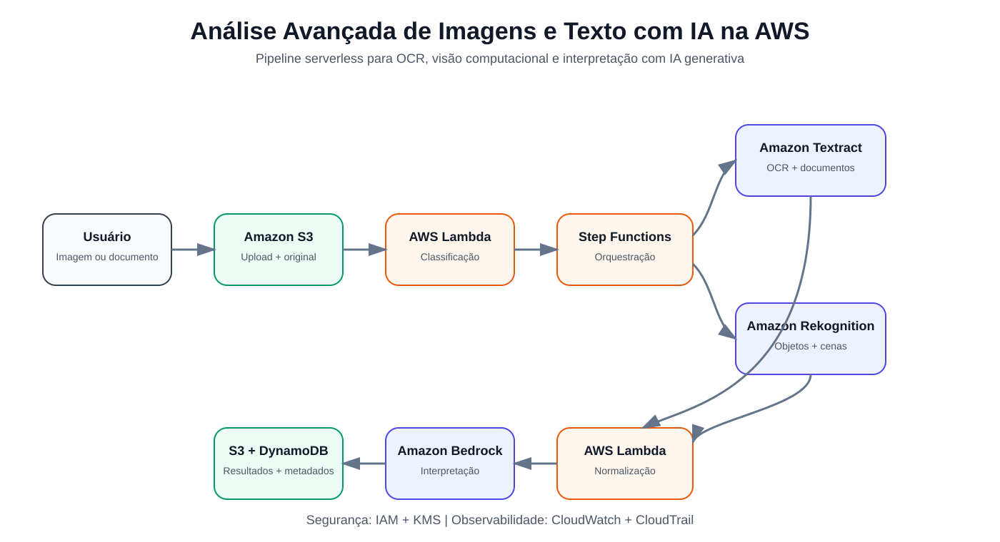
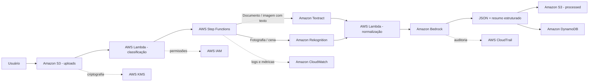

# 🖼️ Análise Avançada de Imagens e Texto com IA na AWS

Projeto de portfólio desenvolvido para o desafio **Análise Avançada de Imagens e Texto com IA na AWS**, da DIO.

A proposta demonstra como combinar serviços gerenciados da AWS para receber imagens e documentos, identificar automaticamente o tipo de conteúdo, extrair texto, reconhecer elementos visuais e gerar uma interpretação final em linguagem natural com IA generativa.

> O foco do projeto não é apenas “mandar uma imagem para uma IA”, mas construir um fluxo rastreável, seguro e escalável, no qual cada serviço possui uma responsabilidade clara.

---

## 🎯 Objetivo

Construir uma arquitetura capaz de responder perguntas sobre arquivos visuais e documentos, como:

- Qual texto aparece neste documento?
- Há anotações manuscritas?
- Quais objetos ou elementos aparecem na imagem?
- Quais informações importantes podem ser extraídas?
- Qual é um resumo do conteúdo?
- Existem informações sensíveis ou que exigem revisão?
- Qual serviço gerou cada parte do resultado?

A solução separa **OCR**, **visão computacional** e **interpretação semântica**, evitando utilizar um único serviço para tarefas que possuem naturezas diferentes.

---

## 🧠 Conceitos praticados

- Inteligência Artificial Generativa na AWS;
- visão computacional;
- OCR e extração de documentos;
- processamento orientado a eventos;
- arquitetura serverless;
- armazenamento de objetos;
- integração entre serviços AWS;
- prompts estruturados;
- normalização de resultados;
- segurança com IAM e KMS;
- logs, auditoria e monitoramento;
- controle de custos;
- rastreabilidade entre entrada e resposta gerada.

---

## 🏗️ Arquitetura proposta





---

# 🔄 Processo de ponta a ponta

## 1. Entrada do arquivo

O usuário envia uma imagem ou documento para o **Amazon S3**. O arquivo original é preservado e recebe um identificador único (`document_id`).

O bucket utiliza:

- S3 Block Public Access;
- criptografia server-side com AWS KMS;
- versionamento;
- checksum para integridade;
- tags para status e tipo de processamento.

O arquivo original nunca é sobrescrito durante o processamento.

---

## 2. Classificação inicial

Um evento do S3 aciona uma **AWS Lambda**.

A função verifica:

- extensão;
- MIME type;
- tamanho;
- metadados;
- tipo provável do conteúdo.

A classificação define qual caminho será executado:

### Documento ou imagem com texto

Segue para **Amazon Textract**.

### Fotografia ou cena visual

Segue para **Amazon Rekognition**.

### Conteúdo misto

Pode passar pelos dois serviços e os resultados são combinados antes da etapa de IA generativa.

Essa separação reduz custo e melhora a qualidade, pois cada serviço é utilizado para o problema em que é especializado.

---

## 3. Extração de texto com Amazon Textract

Para documentos digitalizados, formulários, notas, comprovantes, atas fotografadas ou imagens contendo texto, o **Amazon Textract** é utilizado para OCR.

O resultado pode conter:

- palavras;
- linhas;
- texto manuscrito;
- tabelas;
- formulários;
- coordenadas do conteúdo;
- confiança da detecção.

Além de manter o texto extraído, a solução preserva a confiança retornada pelo serviço.

Trechos com confiança baixa podem receber:

```json
{
  "review_required": true,
  "reason": "low_ocr_confidence"
}
```

Isso impede que uma informação pouco confiável seja apresentada ao usuário como certeza.

---

## 4. Análise visual com Amazon Rekognition

Para fotografias e cenas, o **Amazon Rekognition** fornece informações visuais estruturadas.

A solução pode utilizar recursos como:

- detecção de labels;
- identificação de objetos e cenas;
- moderação de conteúdo;
- propriedades visuais relevantes ao caso de uso.

Exemplo simplificado de resultado:

```json
{
  "labels": [
    {"name": "Laptop", "confidence": 98.4},
    {"name": "Office", "confidence": 96.1},
    {"name": "Person", "confidence": 94.7}
  ]
}
```

Os resultados permanecem estruturados e não são imediatamente convertidos em texto livre.

---

## 5. Normalização dos resultados

Uma Lambda recebe as respostas de Textract e/ou Rekognition e converte tudo para um schema comum.

Exemplo:

```json
{
  "document_id": "img-001",
  "source": "s3://bucket/uploads/exemplo.png",
  "content_type": "mixed",
  "ocr": {
    "text": "Texto encontrado no documento",
    "average_confidence": 96.2
  },
  "vision": {
    "labels": ["Person", "Laptop", "Office"]
  },
  "processing": {
    "status": "ENRICHING",
    "review_required": false
  }
}
```

A padronização facilita armazenamento, auditoria e uso posterior pelo modelo generativo.

---

## 6. Interpretação com Amazon Bedrock

O **Amazon Bedrock** recebe somente informações relevantes extraídas pelos serviços anteriores e produz uma resposta em linguagem natural.

O prompt é estruturado para que o modelo:

1. utilize apenas as evidências fornecidas;
2. não invente informações ausentes;
3. diferencie texto detectado de interpretação;
4. indique incertezas;
5. gere saída estruturada;
6. produza resumo legível para o usuário.

Exemplo de instrução conceitual:

```text
Analise as evidências extraídas do arquivo.
Não invente dados que não apareçam nas evidências.
Retorne um resumo, os principais elementos encontrados,
o texto relevante, possíveis alertas e o nível de confiança.
```

O resultado pode ser armazenado em JSON e também exibido como texto para o usuário.

---

## 7. Armazenamento dos resultados

A solução mantém duas representações:

### Amazon S3

Armazena:

- arquivo original;
- JSON bruto do Textract;
- JSON bruto do Rekognition;
- resultado normalizado;
- resposta enriquecida pelo Bedrock.

### Amazon DynamoDB

Armazena informações operacionais e de consulta rápida:

- `document_id`;
- caminho do arquivo;
- tipo;
- status;
- data de processamento;
- confiança;
- necessidade de revisão;
- resumo;
- erros ocorridos.

---

# 🧩 Serviços AWS utilizados

| Serviço | Responsabilidade |
|---|---|
| Amazon S3 | Entrada, armazenamento e preservação dos arquivos |
| AWS Lambda | Classificação, transformação e normalização |
| AWS Step Functions | Orquestração do pipeline e tratamento de erros |
| Amazon Textract | OCR e extração de texto/documentos |
| Amazon Rekognition | Visão computacional e análise de imagens |
| Amazon Bedrock | Interpretação semântica e geração do resumo |
| Amazon DynamoDB | Metadados e estado de processamento |
| AWS IAM | Controle de permissões entre serviços |
| AWS KMS | Criptografia dos dados |
| Amazon CloudWatch | Logs, métricas e alarmes |
| AWS CloudTrail | Auditoria das chamadas e alterações |

---

# 🛡️ Segurança

A arquitetura considera segurança desde a entrada do arquivo:

- buckets S3 não públicos;
- criptografia em repouso;
- comunicação via HTTPS;
- IAM seguindo o princípio do menor privilégio;
- funções Lambda com permissões específicas;
- separação entre arquivos brutos e processados;
- logs centralizados;
- auditoria de chamadas de API;
- retenção do arquivo original para rastreabilidade.

Em um ambiente corporativo, o pipeline também pode ser conectado ao Amazon Cognito para autenticação de usuários e controle de acesso por perfil.

---

# ⚠️ Tratamento de erros

O Step Functions controla o estado do processamento e aplica estratégias de `Retry` e `Catch`.

Falhas possíveis:

- formato não suportado;
- arquivo corrompido;
- baixa confiança do OCR;
- timeout;
- erro de permissão;
- indisponibilidade temporária de um serviço;
- resposta inválida do modelo generativo.

Quando um processamento falha, o arquivo original continua preservado e o registro recebe status `FAILED`, possibilitando nova tentativa sem perda de dados.

---

# 💰 Otimização de custos

Algumas decisões evitam processamento desnecessário:

- Textract é utilizado somente quando há necessidade de OCR;
- Rekognition é utilizado somente para conteúdo visual relevante;
- Lambda mantém o processamento serverless e sob demanda;
- Step Functions evita lógica complexa de orquestração dentro de uma única função;
- resultados intermediários podem ser reutilizados sem reprocessar o arquivo;
- Lifecycle Policies do S3 podem mover arquivos antigos para classes mais econômicas;
- métricas do CloudWatch ajudam a identificar volume e falhas anormais.

---

# 📊 Exemplo de saída final

O arquivo [`exemplo-saida.json`](./exemplo-saida.json) demonstra como diferentes resultados podem ser consolidados.

Uma apresentação amigável ao usuário poderia ser:

```text
Resumo:
A imagem apresenta um ambiente de escritório com uma pessoa utilizando um notebook.
Também foi detectado texto associado ao documento exibido na cena.

Elementos principais:
- Pessoa
- Notebook
- Ambiente de escritório

Texto detectado:
"Relatório de resultados comerciais"

Confiabilidade:
Alta para os objetos detectados e 96,2% de confiança média para o OCR.

Revisão humana:
Não necessária para este exemplo.
```

---

# 📁 Estrutura do projeto

```text
analise-avancada-imagens-texto-aws/
├── README.md
├── arquitetura.svg
└── exemplo-saida.json
```

---

# 💡 Insights obtidos

## 1. OCR e visão computacional são problemas diferentes

Textract e Rekognition podem receber imagens, mas resolvem problemas diferentes. Um é voltado à compreensão de documentos e texto; o outro, à identificação visual de elementos e cenas.

## 2. IA generativa funciona melhor com evidências estruturadas

Em vez de pedir ao modelo para fazer tudo, o pipeline entrega ao Bedrock resultados já extraídos e organizados. Isso reduz ambiguidades e melhora a rastreabilidade.

## 3. Confiança faz parte do dado

Não basta armazenar o texto detectado. A confiança retornada pelo OCR ou pela visão computacional ajuda a decidir quando a informação pode ser usada automaticamente e quando precisa de revisão.

## 4. Arquitetura orientada a eventos facilita escala

O upload no S3 inicia o processamento automaticamente. Como os componentes são desacoplados, o fluxo pode crescer sem depender de um servidor único executando permanentemente.

## 5. Rastreabilidade é tão importante quanto a resposta

O resultado final mantém `document_id`, caminho do arquivo original, serviços utilizados e status do processamento. Assim, é possível verificar de onde a informação surgiu.

---

# 🚀 Possibilidades de evolução

- criar interface web com AWS Amplify;
- autenticar usuários com Amazon Cognito;
- criar uma API com Amazon API Gateway;
- adicionar busca semântica com Amazon Bedrock Knowledge Bases;
- indexar os resultados para perguntas sobre vários documentos;
- detectar automaticamente documentos sensíveis;
- implementar revisão humana para OCR de baixa confiança;
- processar lotes de arquivos em paralelo;
- criar dashboards operacionais com métricas de volume, confiança e custo;
- usar o pipeline como etapa de entrada para uma solução RAG corporativa.

---

# 🧠 O que aprendi

Este projeto reforçou que uma solução de IA em nuvem não depende apenas do modelo generativo. Para criar um sistema realmente útil, é necessário pensar em ingestão, classificação, extração, normalização, segurança, observabilidade, custo e rastreabilidade.

Também aprendi a separar responsabilidades: **Amazon Textract para entender texto em documentos, Amazon Rekognition para elementos visuais e Amazon Bedrock para interpretar as evidências e gerar uma resposta em linguagem natural**.

Essa abordagem torna a solução mais modular, escalável e adequada a cenários corporativos reais.

---

Projeto desenvolvido por **Luis Felipe Ramalho Carvalho** como entrega prática para a DIO.